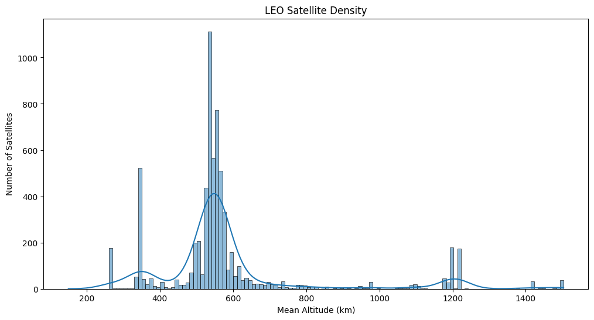
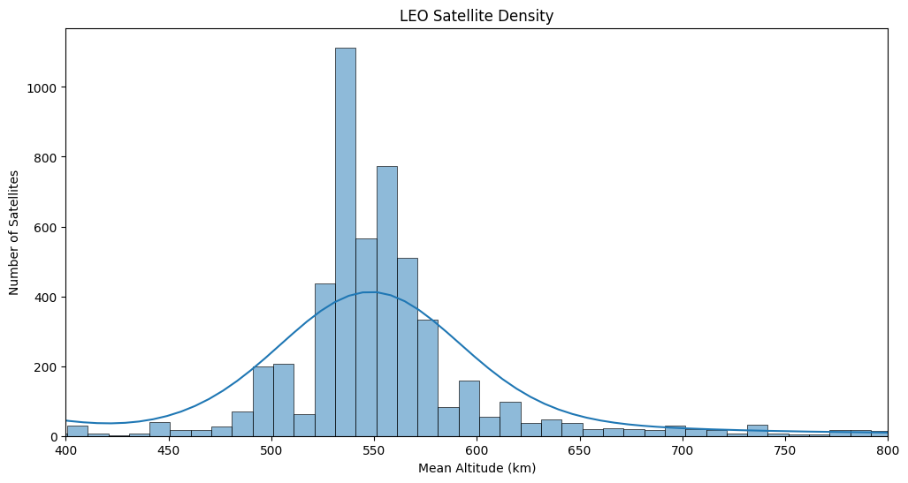

# LEO Orbital Congestion Analysis
**Tools Used:** Python (Pandas, Seaborn, Matplotlib)

## Overview
With the rapid launch of commercial mega-constellations, traffic density in Low Earth Orbit (LEO) has become a major challenge for space operations. In fact, out of the **7,560** active satellites in the UCS (Union of Concerned Scientists) database, **6,765 (89.5%)** are concentrated entirely within LEO. This project maps the spatial distribution of this critical infrastructure, validates orbital metrics, and identifies where the most severe traffic bottlenecks are located.

## Key Findings
* **The SpaceX Bottleneck:** Using high-resolution 10 km altitude bins, the analysis identified that the **530 - 540 km** orbital band is the most crowded shell in space. There are **1,147** satellites packed into this single 10 km band. **SpaceX** operates **986** of them, meaning a single company controls **86% of the hardware** at this critical altitude.
* **Data Entry Errors Found:** A diagnostic check on the database caught human classification errors. Two Geostationary (GEO) satellites (orbiting at ~35,000 km) were mistakenly labeled as LEO. These anomalies were filtered out.
* **Orbit Validation:** More than **99.6%** of active LEO satellites run on highly circular paths (eccentricity **e < 0.05**). This confirmed that calculating a simple geometric Mean Altitude (`(Perigee + Apogee) / 2`) is a reliable metric for locating these satellites.

## Visualizations

### 1. Macro View: The Global LEO Distribution

> **Figure 1:** The complete spatial distribution of LEO assets (160 - 2,000 km). The extreme congestion at ~540 km dwarfs all other orbital shells.

### 2. Micro View: The SpaceX Bottleneck

> **Figure 2:** A high-resolution 10 km bin analysis isolating the primary traffic bottleneck.
